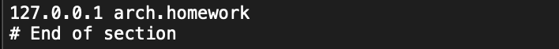
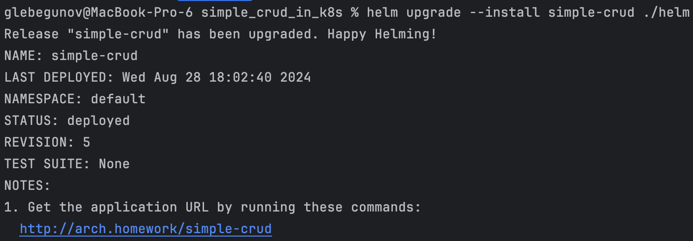
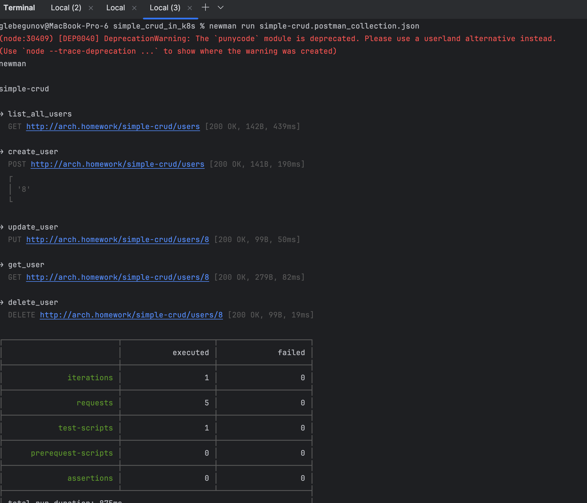
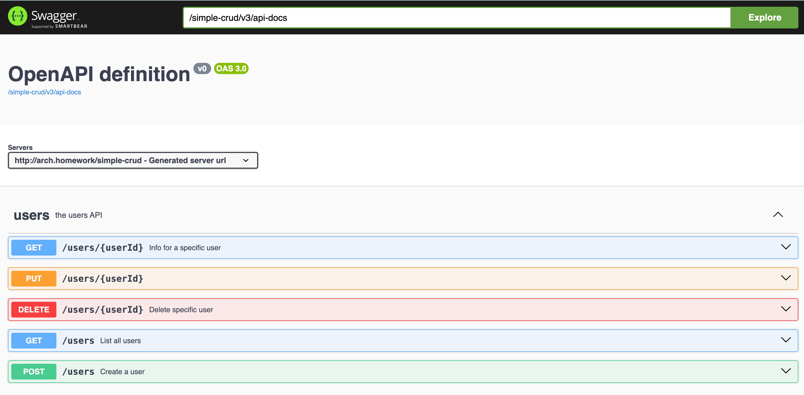

# Простое CRUD приложение для демонстрации навыков работы с Docker + Kubernetes + Helm
## Особенности реализации и применённые техники:
- Приложение состоит из двух основных сервисов: Сервис на Java и База данных Postgres
- Каждый сервис запускается в отдельной поде в k8s
- Для начальной инициализации БД (и последующих миграций в случае необходимости) используется джоба миграции 
(модуль [migration](migration)).  
  - Логика миграции выполняется с помощью liquibase-maven-plugin
  - При запуске джоба проверяет соединение к БД и ждёт при необходимости (реализовано с помощью init-containers)
  - После того как БД поднялась, вызов плагина с помощью команды `liquibase:update`
-  Java сервис запускается в 2 инстансах
-  Перед запуском deployment ждёт, пока завершится джоба миграции (для этого используется `groundnuty/k8s-wait-for` в init-containers deployment'a)
- использовался nginx ingress контроллер, установленный через `helm`, а не встроенный в minikube:
   >helm repo add ingress-nginx https://kubernetes.github.io/ingress-nginx/ && helm repo update && helm install nginx ingress-nginx/ingress-nginx -f [nginx-ingress.yaml](nginx_ingress.yaml)
- При запуске на **macOS** или **Windows**
 для того, чтобы хост `arch.homework` резолвился **необходимо** использовать команду `minikube tunnel` и в `/etc/hosts` прописать ip `127.0.0.1` (**не minikube ip**)   

## Использованные технологии

 Для создания CRUD приложения и сборки jar-файла: **Java**, **Spring Boot**, **maven**, **MapStruct**, **openapi**
 
 БД и миграции: **PostgreSQL**, **liquibase**

 Для сборки в контейнер: **docker**

 Для деплоя в k8s: **Helm**

 Развёртывание производилось в одно-нодовом локальном кластере (**Minikube**)

 Для тестирования использовался **newman** + **postman collection**

## Деплой в k8s:

1. перейти в корневую директорию проекта
2. выполнить команду
    > helm upgrade --install simple-crud ./helm
3. В случае успешного выполнения вывод будет таким: 
4. При запуске на **macOS** или **Windows**
    для того, чтобы хост `arch.homework` резолвился **необходимо** использовать команду `minikube tunnel` и в `/etc/hosts` прописать ip `127.0.0.1` (**не minikube ip**) 

## Тестирование
После деплоя в kubernetes можно выполнить тестирование несколькими способами:
1. Используя приложенную [postman коллекцию](simple-crud.postman_collection.json).
   - импортируйте её в postman или выполните newman
       > newman run simple-crud.postman_collection.json
   
   - 
2. Перейти в Swagger UI по адресу:
    http://arch.homework/simple-crud/swagger-ui/index.html 
    - Вызывать методы сервиса вручную
   